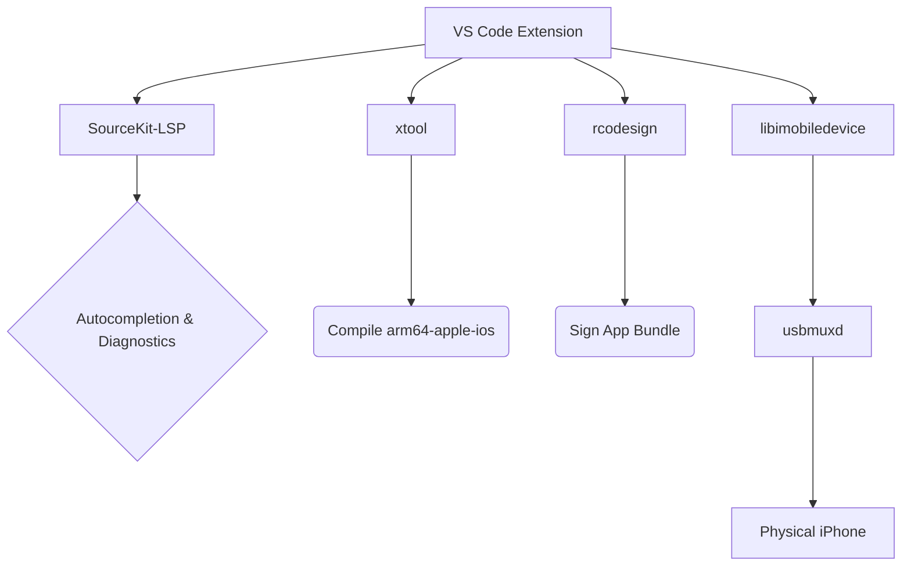

# LibreSwift iOS Development for VS Code

**LibreSwift** empowers developers to build, sign, and deploy native iOS Swift applications directly to an iPhone over USB from Linux (and WSL), fully bypassing the need for macOS and Xcode.

## Architecture

## Features

*   **Native Swift IntelliSense**: Cross-compiled SourceKit-LSP integration.
*   **One-Click Deployment**: Build, sign, and push to a connected iOS device natively.
*   **Real-time Logs**: Stream `idevicesyslog` directly to the VS Code output console.
*   **Automated SDK Extraction**: Unpack official Xcode `.xip` files on Linux automatically.
*   **Secure Secret Management**: Keep your Apple Developer `.p12` certificates secure using VS Code `SecretStorage`.

## Prerequisites

To use LibreSwift on Linux, you must have the following system dependencies installed and in your `$PATH`:

1.  `xtool` - Used for cross-compiling Swift.
2.  `rcodesign` - Used for cryptographic signing without macOS.
3.  `libimobiledevice` (specifically `ideviceinstaller`, `idevicesyslog`, `idevice_id`) - Used for interacting with iOS devices.
4.  `usbmuxd` - Daemon for USB communication with iOS devices.
5.  `xar`, `pbzx`, and `cpio` - Used for unpacking Xcode `.xip` archives.
6.  `sourcekit-lsp` - Ensure the Swift toolchain is installed.

### Windows Subsystem for Linux (WSL)

If you are running LibreSwift under WSL2, you must pass your iPhone's USB connection through to Linux using `usbipd-win`. 
1. Open PowerShell on Windows: `usbipd list`
2. Bind the device: `usbipd bind --busid <busid>`
3. Attach to WSL: `usbipd attach --wsl --busid <busid>`

## Quickstart

1. Install LibreSwift in VS Code.
2. Open the **LibreSwift Welcome Walkthrough** via the Command Palette (`Ctrl+Shift+P` -> `Welcome: Open Walkthrough` -> `LibreSwift`).
3. Follow the walkthrough to extract the SDK and set up your certificate password.
4. Open a Swift file, wait for SourceKit-LSP to initialize, and click the **$(play) Run on iOS** button in your title bar or status bar to deploy!

## Configuration Options

You can customize paths in `.vscode/settings.json`:
*   `libreswift.sdkPath`: Absolute path to `iPhoneOS.sdk` (Default: `~/.local/share/ios-linux-sdk/iPhoneOS.sdk`)
*   `libreswift.p12Path`: Absolute path to your `.p12` Apple Developer certificate.
*   `libreswift.mobileprovisionPath`: Absolute path to your `.mobileprovision` file.
*   `libreswift.bundleIdentifier`: The bundle ID of your application.

## License

MIT License. See [LICENSE](LICENSE) for more information.
