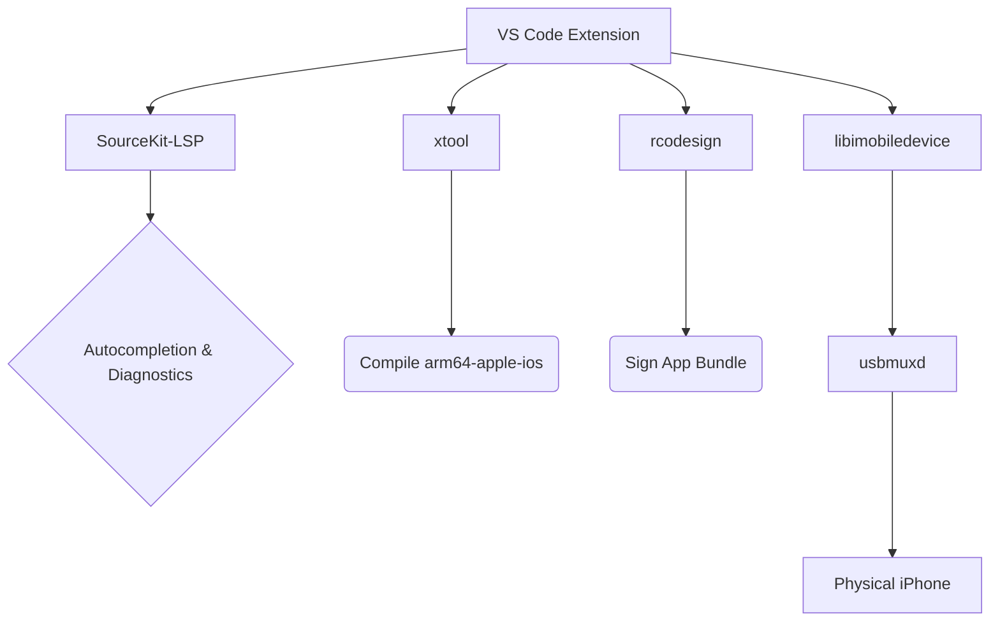

# LibreSwift iOS Development for VS Code

[](https://opensource.org/licenses/MIT)
[](https://github.com/kisalnelaka/LibreSwift)
[](https://marketplace.visualstudio.com/items?itemName=kisalnelaka.libreswift)

**LibreSwift** empowers developers to build, sign, and deploy native iOS Swift applications directly to an iPhone over USB from Linux (and WSL), fully bypassing the need for macOS and Xcode.

## Architecture



## Features

| Feature | Description |
|---|---|
| 🚀 **One-Click Setup Engine** | Installs all Linux dependencies and toolchains automatically |
| ✨ **Native Swift IntelliSense** | Cross-compiled SourceKit-LSP for iOS targets |
| 📱 **One-Click Deployment** | Build, sign, and push to a physical device natively |
| 📋 **Real-time Device Logs** | Stream `idevicesyslog` output directly into VS Code |
| 📦 **Automated SDK Extraction** | Unpack Xcode `.xip` archives on Linux automatically |
| 🔐 **Secure Secret Management** | `.p12` passwords stored via VS Code `SecretStorage` (OS keychain) |
| 👋 **Interactive Onboarding** | Auto-triggered Welcome Walkthrough on first install, skippable |
| 📖 **Help & Manual** | Full in-app manual with 10 chapters, searchable sidebar |
| ⭐ **Smart Feedback Webview** | In-app 5-star rating — negative feedback goes to devs, 5 stars goes to the Marketplace and GitHub |

## Getting Started

> **New users:** On first install, LibreSwift automatically opens a guided onboarding walkthrough. Just follow the steps — you can skip at any time and return to it later via `Ctrl+Shift+P` → `Welcome: Open Walkthrough` → `LibreSwift`.

### Step 1 — Run the One-Click Setup Engine

Open the Command Palette (`Ctrl+Shift+P`) and run:

```
LibreSwift: One-Click Automated Setup Engine
```

This installs all required system packages (`usbmuxd`, `libimobiledevice`, etc.) and downloads the LibreSwift toolchains (`xtool`, `rcodesign`) automatically.

### Step 2 — Extract the iPhoneOS SDK

Download an official **Xcode `.xip`** from [developer.apple.com](https://developer.apple.com/download/more/) (free Apple ID required), then run:

```
LibreSwift: Setup iOS Environment (Extract SDK)
```

### Step 3 — Configure Code Signing

In VS Code Settings, set:
- `libreswift.p12Path` → path to your `.p12` Apple Developer certificate
- `libreswift.mobileprovisionPath` → path to your `.mobileprovision` file

Then run `LibreSwift: Set P12 Password` to store your certificate password securely.

### Step 4 — Connect & Deploy

Plug in your iPhone via USB, trust the computer on your device, then click **▶ Run on iOS** in the status bar.

### Windows Subsystem for Linux (WSL)

WSL2 requires USB passthrough via [`usbipd-win`](https://github.com/dorssel/usbipd-win):

```powershell
# In PowerShell (Admin)
usbipd list
usbipd bind --busid <busid>
usbipd attach --wsl --busid <busid>
```

## Commands

| Command | Description |
|---|---|
| `LibreSwift: One-Click Automated Setup Engine` | Install all dependencies automatically |
| `LibreSwift: Setup iOS Environment (Extract SDK)` | Extract iPhoneOS.sdk from Xcode .xip |
| `LibreSwift: Run on Connected iOS Device` | Build, sign & deploy |
| `LibreSwift: Set P12 Password` | Store certificate password securely |
| `LibreSwift: Refresh Devices` | Re-scan for connected devices |
| `LibreSwift: Restart SourceKit-LSP` | Restart the Swift language server |
| `LibreSwift: Show Device Logs` | Open device log output channel |
| `LibreSwift: Help & Manual` | Open the full in-app manual |
| `LibreSwift: Provide Feedback / Rate` | Open the in-app feedback & rating panel |

## Configuration

| Setting | Default | Description |
|---|---|---|
| `libreswift.sdkPath` | `~/.local/share/ios-linux-sdk/iPhoneOS.sdk` | Path to extracted iPhoneOS.sdk |
| `libreswift.p12Path` | _(empty)_ | Path to your `.p12` developer certificate |
| `libreswift.mobileprovisionPath` | _(empty)_ | Path to your `.mobileprovision` file |
| `libreswift.bundleIdentifier` | `com.example.App` | Bundle ID of your iOS app |

## Prerequisites

The following tools must be available on your system. The Setup Engine installs them automatically:

1. [`xtool`](https://github.com/kabiroberai/xtool) — cross-compiler for Swift targeting iOS
2. [`rcodesign`](https://github.com/indygreg/apple-platform-rs) — code signing without macOS
3. [`libimobiledevice`](https://libimobiledevice.org/) — iOS device communication
4. [`usbmuxd`](https://github.com/libimobiledevice/usbmuxd) — USB daemon for iPhone
5. [`pbzx`](https://github.com/NiklasRosenstein/pbzx), `xar`, `cpio` — archive utilities for `.xip` extraction
6. [`sourcekit-lsp`](https://github.com/apple/sourcekit-lsp) — Swift language server (via [swift.org](https://swift.org/install))

## License

MIT License. See [LICENSE](LICENSE) for more information.

## Acknowledgments

A massive thank you to the developers and maintainers of the open-source tools that make LibreSwift possible:
- The [apple-platform-rs](https://github.com/indygreg/apple-platform-rs) team for `rcodesign`.
- The [libimobiledevice](https://libimobiledevice.org/) community for reverse engineering Apple's protocols.
- The creators of `xtool`, `pbzx`, and the Swift open-source community.
