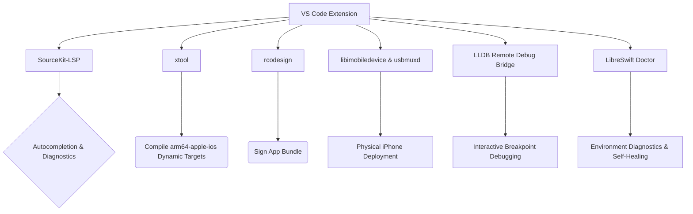

# LibreSwift iOS Development for VS Code

[](https://opensource.org/licenses/MIT)
[](https://github.com/kisalnelaka/LibreSwift)
[](https://marketplace.visualstudio.com/items?itemName=kisalnelaka.libreswift)

**LibreSwift** empowers developers to build, debug, sign, and deploy native iOS Swift applications directly to an iPhone over USB from Linux (and WSL), fully bypassing the need for macOS and Xcode.

## Architecture



## Features

| Feature | Description |
|---|---|
| 🏗️ **Project Scaffolding Wizard** | Interactive generator for new iOS projects with starter templates: **SwiftUI**, **UIKit**, and **Swift CLI** with pre-configured Package.swift, Info.plist, and VS Code tasks |
| 🔑 **Free Apple ID Self-Signing** | Automated 7-day developer certificate & provisioning profile generation using a free Apple ID — deploy to personal iPhones without a Mac or $99/yr license |
| 🩺 **LibreSwift Doctor** | Automated health-check engine scanning CLI tools, SDK headers, usbmuxd sockets, USB pairing trust, and certificate validity with one-click fixes |
| 🐛 **Interactive LLDB Debugging** | Connect VS Code debug sessions to physical iOS devices with breakpoint, variable watch, and stack trace inspection |
| ⚙️ **Dynamic Target & Release Modes** | Support for custom target triples (`arm64-apple-ios`), minimum iOS versions, dynamic `.app` discovery, and Debug vs. Release optimization profiles |
| 🚀 **One-Click Setup Engine** | Installs all Linux dependencies and toolchains automatically |
| ✨ **Native Swift IntelliSense** | Cross-compiled SourceKit-LSP for iOS targets with dynamic compiler flag injection |
| 📱 **One-Click Deployment** | Build, sign, and push to a physical device natively over USB |
| 📋 **Real-time Device Logs** | Stream `idevicesyslog` output directly into VS Code |
| 📦 **Automated SDK Extraction** | Unpack Xcode `.xip` archives on Linux automatically |
| 🔐 **Secure Secret Management** | Apple ID and `.p12` passwords stored via VS Code `SecretStorage` (OS keychain) |
| 👋 **Interactive Onboarding** | Auto-triggered Welcome Walkthrough on first install, skippable |
| 📖 **Help & Manual** | Full in-app manual with 10 chapters and searchable sidebar |
| ⭐ **Smart Feedback Webview** | Direct review link to VS Code Marketplace, GitHub star shortcuts, and issue reporting |

## Getting Started

> **New users:** On first install, LibreSwift automatically opens a guided onboarding walkthrough. Just follow the steps — you can skip at any time and return to it later via `Ctrl+Shift+P` → `Welcome: Open Walkthrough` → `LibreSwift`.

### Step 1 — Create a New iOS Project or Open an Existing One

To scaffold a fresh iOS app with all build tasks pre-configured, open the Command Palette (`Ctrl+Shift+P`) and run:

```
LibreSwift: Create New iOS Project (SwiftUI / UIKit)
```

Choose from **SwiftUI iOS App**, **UIKit iOS App**, or **Swift CLI Tool**.

### Step 2 — Run the One-Click Setup Engine & Doctor

Open the Command Palette and run:

```
LibreSwift: One-Click Automated Setup Engine
```

To verify your system state at any time, run:

```
LibreSwift: Run Doctor (System Diagnostics)
```

### Step 3 — Extract the iPhoneOS SDK

Download an official **Xcode `.xip`** from [developer.apple.com](https://developer.apple.com/download/more/) (free Apple ID required), then run:

```
LibreSwift: Setup iOS Environment (Extract SDK)
```

### Step 4 — Configure Code Signing

LibreSwift supports two signing methods:

1. **Free Apple ID Signing (Recommended — Zero Mac Required):**
   Run `LibreSwift: Configure Apple ID Signing (Free Developer Account)` and enter your Apple ID email. LibreSwift generates a local 7-day development certificate and profile automatically.
2. **Manual .p12 & Provisioning Profile:**
   In VS Code Settings, set `libreswift.p12Path` and `libreswift.mobileprovisionPath`, then run `LibreSwift: Set P12 Password`.

### Step 5 — Connect, Deploy & Debug

1. Plug in your iPhone via USB, unlock it, and trust the computer.
2. Click **▶ Run on iOS** in the status bar or **🐞 Debug on Connected iOS Device** to start an interactive LLDB debug session.

### Windows Subsystem for Linux (WSL)

WSL2 requires USB passthrough via [`usbipd-win`](https://github.com/dorssel/usbipd-win):

```powershell
# In PowerShell (Admin)
usbipd list
usbipd bind --busid <busid>
usbipd attach --wsl --busid <busid>
```

## Commands

| Command | Description |
|---|---|
| `LibreSwift: Create New iOS Project (SwiftUI / UIKit)` | Interactive wizard to scaffold new SwiftUI, UIKit, or CLI iOS projects |
| `LibreSwift: Configure Apple ID Signing` | Configure Free Apple ID for automated 7-day certificate generation |
| `LibreSwift: Renew 7-Day Signing Certificate` | 1-Click renewal for free Apple ID developer certificates |
| `LibreSwift: Run Doctor (System Diagnostics)` | Run automated health check across toolchains, SDK, sockets & certificates |
| `LibreSwift: One-Click Automated Setup Engine` | Install all dependencies automatically |
| `LibreSwift: Setup iOS Environment (Extract SDK)` | Extract iPhoneOS.sdk from Xcode .xip |
| `LibreSwift: Run on Connected iOS Device` | Build, sign & deploy to device |
| `LibreSwift: Debug on Connected iOS Device` | Build, sign, deploy & attach LLDB remote debug session |
| `LibreSwift: Set P12 Password` | Store certificate password securely in OS keychain |
| `LibreSwift: Refresh Devices` | Re-scan for connected USB devices |
| `LibreSwift: Restart SourceKit-LSP` | Restart the Swift language server |
| `LibreSwift: SourceKit-LSP Status` | Check running state of SourceKit-LSP |
| `LibreSwift: Show Device Logs` | Open device log output channel |
| `LibreSwift: Help & Manual` | Open the full in-app manual |
| `LibreSwift: Provide Feedback / Rate` | Open the in-app feedback & rating panel |
| `LibreSwift: Rate on VS Code Marketplace` | Open marketplace review page directly |
| `LibreSwift: Star on GitHub` | Open GitHub repository to star or contribute |

## Configuration

| Setting | Default | Description |
|---|---|---|
| `libreswift.signingMode` | `auto` | Signing mode: `auto` (free Apple ID preferred), `appleId`, or `p12` |
| `libreswift.sdkPath` | `~/.local/share/ios-linux-sdk/iPhoneOS.sdk` | Path to extracted iPhoneOS.sdk |
| `libreswift.targetTriple` | `arm64-apple-ios` | Target architecture triple for cross-compilation |
| `libreswift.minIOSVersion` | `17.0` | Minimum target iOS deployment version |
| `libreswift.buildConfiguration` | `debug` | Build configuration (`debug` or `release`) |
| `libreswift.appName` | _(empty)_ | Target .app bundle name (auto-detected if empty) |
| `libreswift.p12Path` | _(empty)_ | Path to your `.p12` developer certificate (for manual mode) |
| `libreswift.mobileprovisionPath` | _(empty)_ | Path to your `.mobileprovision` file (for manual mode) |
| `libreswift.bundleIdentifier` | `com.example.App` | Bundle ID of your iOS app |

## Issues & Support

If you encounter bugs, missing toolchains, or unexpected behavior:

1. Run **`LibreSwift: Run Doctor (System Diagnostics)`** from the Command Palette (`Ctrl+Shift+P`).
2. Review the health matrix for any misconfigured SDK paths, broken USB sockets, or missing CLI tools.
3. Open an issue on GitHub: [GitHub Issues](https://github.com/kisalnelaka/LibreSwift/issues/new).
4. Attach the Doctor output log and the relevant section from **`LibreSwift: Show Device Logs`**.

## Contributing

We welcome contributions from the community! To maintain stability, the repository follows a strict branch lifecycle:

### Branching Model
* **`master`** — **Source of Truth (SoT)**. Production-ready, stable releases deployed to VS Code Marketplace and Open VSX.
* **`development`** — Active development, new features, and integration testing. All pull requests must target `development`.

### Development Workflow
1. Fork the repository and clone it locally.
2. Check out the `development` branch:
   ```bash
   git checkout development
   ```
3. Create a feature branch:
   ```bash
   git checkout -b feat/your-feature-name
   ```
4. Install dependencies and compile:
   ```bash
   npm install
   npm run compile
   ```
5. Run the test suite:
   ```bash
   node ./out/test/runTest.js
   ```
6. Commit using [Conventional Commits](https://www.conventionalcommits.org/) (`feat:`, `fix:`, `docs:`, `refactor:`, `test:`).
7. Submit a Pull Request targeting the **`development`** branch.

For full guidelines, see [CONTRIBUTING.md](CONTRIBUTING.md).

## Prerequisites

The following tools are used by LibreSwift. The Setup Engine and Doctor help you install and verify them:

1. [`xtool`](https://github.com/kabiroberai/xtool) — cross-compiler for Swift targeting iOS
2. [`rcodesign`](https://github.com/indygreg/apple-platform-rs) — code signing without macOS
3. [`libimobiledevice`](https://libimobiledevice.org/) — iOS device communication & syslog streaming
4. [`usbmuxd`](https://github.com/libimobiledevice/usbmuxd) — USB daemon for iPhone
5. [`sourcekit-lsp`](https://github.com/apple/sourcekit-lsp) — Swift language server
6. [`pbzx`](https://github.com/NiklasRosenstein/pbzx), `xar`, `cpio` — archive utilities for `.xip` extraction
7. `lldb` — debugger for interactive debugging sessions

## License

MIT License. See [LICENSE](LICENSE) for more information.

## Acknowledgments

A massive thank you to the developers and maintainers of the open-source tools that make LibreSwift possible:
- The [apple-platform-rs](https://github.com/indygreg/apple-platform-rs) team for `rcodesign`.
- The [libimobiledevice](https://libimobiledevice.org/) community for reverse engineering Apple's protocols.
- The creators of `xtool`, `pbzx`, and the Swift open-source community.
